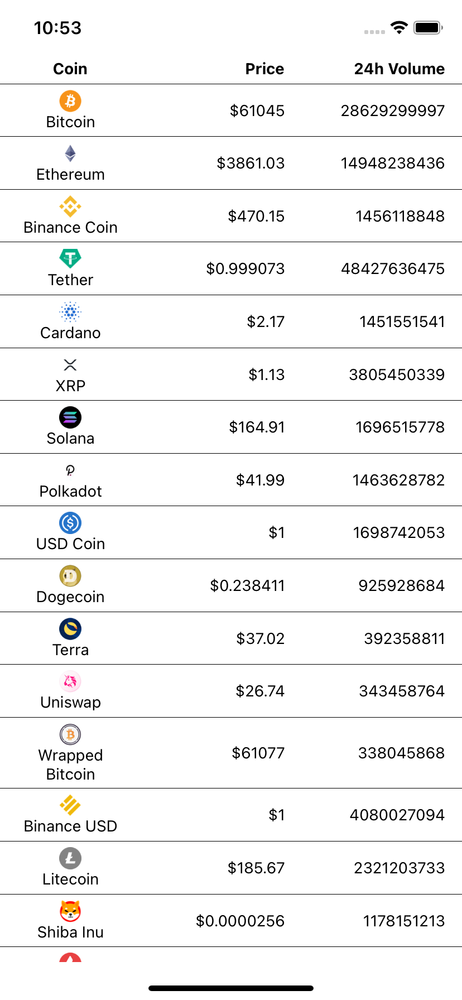
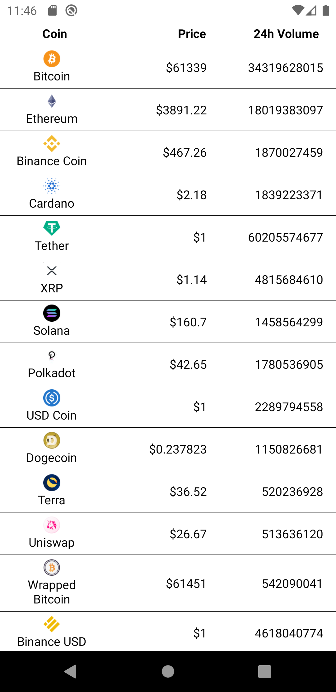
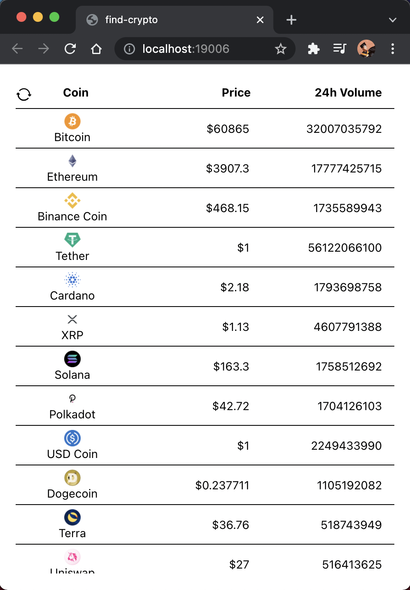
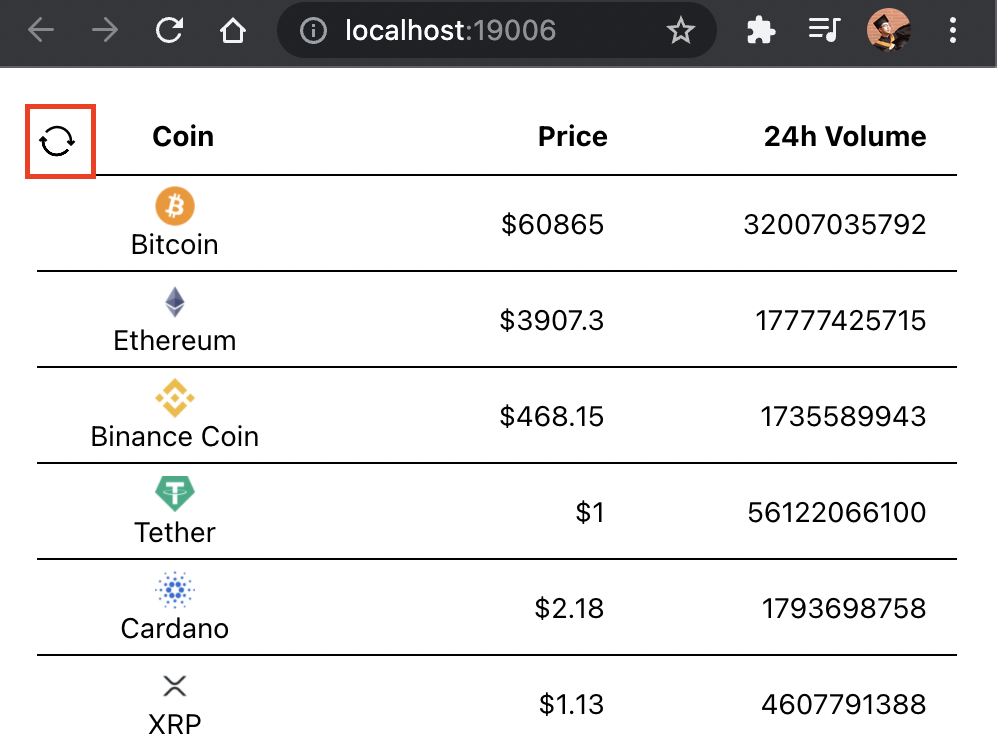
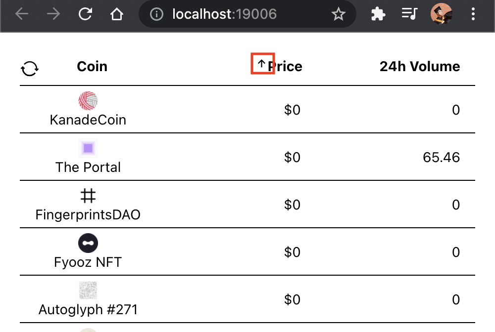
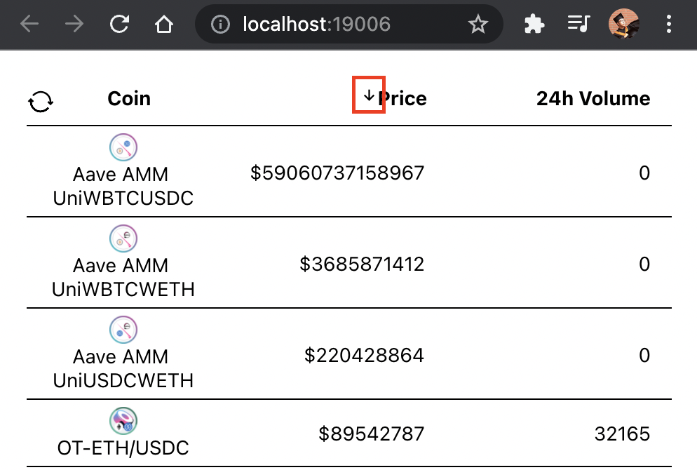

# Find Crypto

Find Crypto is an APP to help you find the right crypto currency. The project is made with React Native, supports ios, android and web platforms

<div style="display: flex; justify-content: space-evenly; flex-wrap: wrap;">
  
  
  
</div>

## Usage

The APP shows first 25 Cryptocurrency order by Market Cap, will load more when scrolling down to the bottom. Refresh the data by pulling down the list. (On the browser a sync button shows on the top left side)

<div style="display: flex; justify-content: space-evenly;">

</div>

Also the crypto list can be order by name, price and volume. Click on the column of the header to choose. First click will order by ascending (with up icon), second click on the same column will order by descending. (with down icon)

<div style="display: flex; justify-content: space-evenly; flex-wrap: wrap;">
  
  
</div>

**NOTE:**
When Click on the coin column, it will use `id` to sort, because sort key `name` not working, `coin_name` acting wield.

# Installation

There are two ways to run the APP, the easiest way is with Expo CLI, another is to use React Native CLI. There is a good document about these, see more at [Setting up the development environment](https://reactnative.dev/docs/environment-setup).

In order to build and run the APP, we needs to install NodeJs on the system, make sure the version is higher than 12.

Next we can clone the repository onto the system.

To install the dependencies run `npm install` or `yarn install` in the terminal

# Run the APP

## Run with Expo

To run with Expo we also need the expo CLI to be installed.

```
npm installed -g expo-cli
```

Expo can let us run and test the APP without installing it to the mobile device. This can be achieve by the [Expo Go APP](https://expo.dev/client). Install it on the phone first.

After that we can run `expo start` in the terminal to build and start the development server. The command line will show a QR code, use the cell phone to scan it then it will open the Expo Go APP to run the Find Crypto APP.

The APP can also be run in cellphone emulators. Make sure the emulator is setup in your development environment. To start ios emulator press `i` in the terminal. To Start Android emulator press `a` in the terminal.

If you want to run on the web press `w` in the terminal then a browser tab will be opened with the APP.

## Run with React Native CLI

React Native CLI can build the APP and install it to the ios and Android simulator. But there are much more thing needs to be down first. Please follow the guide in [Setting up the development environment](https://reactnative.dev/docs/environment-setup).

After setting up we can run `npx react-native run-ios` to start the ios simulator with the app installed, `npx react-native run-android` to start with the Android simulator.

**NOTE:** Android 10 (Q) SDK is required, simulator of other version won't work.
